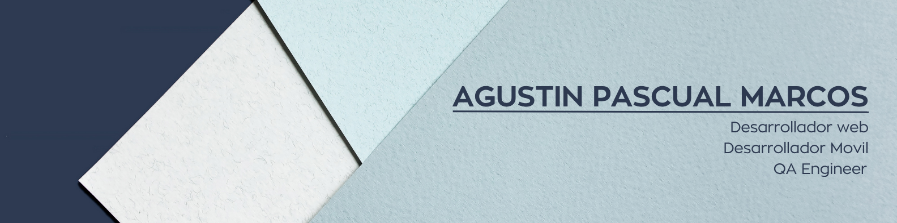

<h3> :man_technologist: &nbsp;Acerca de Mí </h3>

Soy **Estudiante de Ingeniería en Sistemas de Información** con una fuerte vocación por el desarrollo de software y el testing de calidad. Cuento con experiencia en **QA manual y automatizado**, así como en el **desarrollo de aplicaciones web y móviles**.

He participado en proyectos donde mis responsabilidades incluyeron el análisis de documentación, diseño y ejecución de casos de prueba (manuales y automatizados), validación de APIs con Postman y documentación de errores. 

- 🔭 Actualmente estoy enfocado en mis estudios universitarios y en proyectos de desarrollo personal.
- 🌱 Siempre estoy aprendiendo y mejorando mis habilidades en el desarrollo de software y QA.
- 👯 Busco colaborar en proyectos innovadores donde pueda aportar mis conocimientos y seguir creciendo profesionalmente.
- 💬 Pregúntame sobre **Python, Flask, React, React Native, QA y metodologías ágiles**.

 
<h3> 🤝🏻 &nbsp;Conéctate Conmigo </h3>

  &nbsp;
  &nbsp;

<h3> 🛠 &nbsp;Tecnologías y Habilidades</h3>

- 💻 &nbsp; **Lenguajes:** Python, JavaScript 
- 🌐 &nbsp; **Frameworks:** Flask, React.js, React Native 
- 🛢 &nbsp; **Bases de Datos:** PostgreSQL, MySQL 
- 🧪 &nbsp; **QA/Testing:** PyTest, Selenium, Cypress, QA Manual, Casos de prueba, Jira, Trello, Pruebas funcionales 
- ⚙️ &nbsp; **Herramientas y Otros:** Git, GitHub, Docker, Postman, Scrum, UML, Diseño OO 

 

## 📝 Mis Proyectos Destacados

<table width="100%">
  <tr>
    <td width="33%" align="center">
      
       
      

        
        
      

    </td>
    <td width="33%" align="center">
      
       
      

        
        
        
      

    </td>
    <td width="33%" align="center">
      
       
      

        
        
        
      

    </td>
  </tr>
</table>
 
