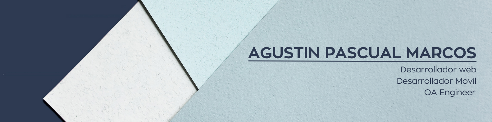

<h3> &nbsp;Acerca de Mí </h3>

Soy **Desarrollador Full Stack & Mobile y especialista en QA Automation**, además de ser estudiante avanzado de Ingeniería en Sistemas de Información (UTN FRLP). Me apasiona diseñar arquitecturas robustas y construir soluciones escalables end-to-end.

A lo largo de mi trayectoria, he liderado el desarrollo de plataformas transaccionales con alta concurrencia (+3,500 usuarios) y SaaS B2B, garantizando su estabilidad mediante testing automatizado y despliegues CI/CD. Mi enfoque técnico prioriza la experiencia del usuario, el modelado de datos eficiente y la optimización de rendimiento.

- 🚀 Actualmente enfocado en el diseño de REST APIs escalables (FastAPI) y aplicaciones multiplataforma (React Native).
- 🛠️ Construyendo "Engineering Projects Showcase", un repositorio donde documento la arquitectura, diagramas UML y flujos críticos de mis proyectos de código cerrado.
- 💡 Busco colaborar en equipos de producto dinámicos para construir software moderno y resiliente.
- 📫 Pregúntame sobre **React Native, FastAPI, PostgreSQL, CI/CD, Docker y automatización con PyTest/Playwright**.

 
<h3> &nbsp;Conéctate Conmigo </h3>

  &nbsp;
  &nbsp;

<h3> &nbsp;Tecnologías y Habilidades</h3>

- &nbsp; **Frontend & Mobile:** React.js, React Native, JavaScript 
- &nbsp; **Backend & Arquitectura:** Python, FastAPI, Flask, REST API, Microservicios 
- &nbsp; **Bases de Datos:** PostgreSQL, MySQL, SQL 
- &nbsp; **QA & Testing Automation:** Selenium, PyTest, Cypress, Playwright, JMeter, k6, Postman 
- &nbsp; **DevOps & Diseño:** Docker, Git/GitHub, CI/CD Pipelines, Scrum/Agile, Modelado UML 

 

## Mis Proyectos Destacados

<table width="100%">
  <tr>
    <td width="25%" align="center">
      <h3>📦 Velo</h3>
      
Ecosistema Mobile de Delivery (B2C)

      <a href="https://github.com/Aguspascual/Presentacion-de-proyectos/blob/main/README.md"><b>📄 Arquitectura y Docs</b></a>
        
      
       
      
    </td>
    <td width="25%" align="center">
      <h3>🚜 AgroManager</h3>
      
SaaS Multi-tenant Agrícola (B2B)

      <a href="https://github.com/Aguspascual/Presentacion-de-proyectos/blob/main/AgroManager/README.md"><b>📄 Arquitectura y Docs</b></a>
        
      
       
      
    </td>
    <td width="25%" align="center">
      <h3>🏭 EcoPolo</h3>
      
Mantenimiento Corporativo

      <a href="https://github.com/Aguspascual/Presentacion-de-proyectos/blob/main/EcoPolo/README.md"><b>📄 Arquitectura y Docs</b></a>
        
      
       
      
    </td>
    <td width="25%" align="center">
      <h3>⚡ Buscapolo</h3>
      
Gestión para Servicios Eléctricos

      <a href="https://github.com/Aguspascual/Buscapolo"><b>💻 Repositorio/Código</b></a>
        
      
       
      
    </td>
  </tr>
</table>
 
 
 
